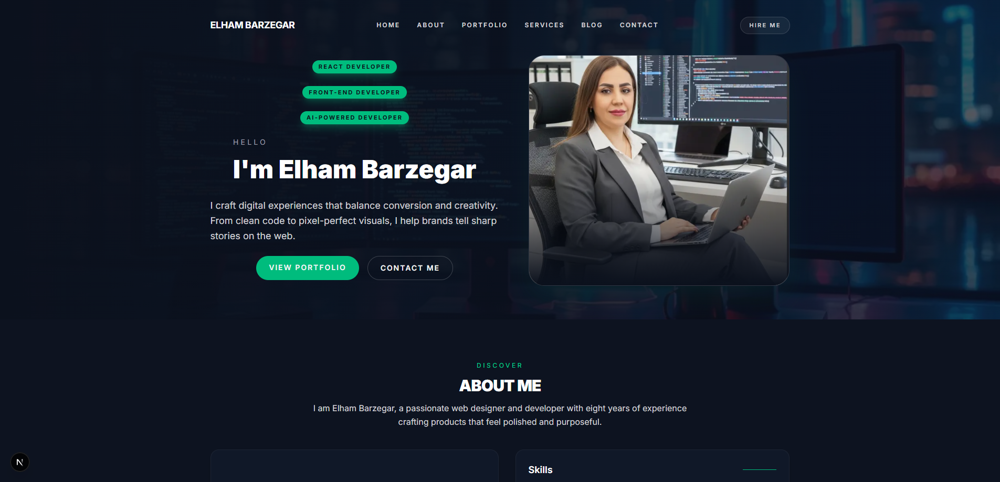

# My Portfolio Website

A modern and responsive personal portfolio website built to showcase frontend development skills, projects, and professional experience.

## 🚀 Live Demo

https://portfolio-elham-dev.vercel.app/

[https://portfolio-elham-dev.vercel.app/]

## 🛠️ Tech Stack

- Next.js
- React
- TypeScript
- Tailwind CSS

## ✨ Features

- Responsive design
- Modern UI
- Reusable React components
- Responsive navigation
- Project showcase
- Clean and maintainable frontend structure

## 🎯 Purpose

This project was created as a personal portfolio to present frontend development projects and technical skills.

## 👩‍💻 Author

**Elham Barzegar**

- Portfolio: https://elhambarzegar.ir/
- GitHub: https://github.com/elham-barzegar
- LinkedIn: https://www.linkedin.com/in/elhambarzegar/
